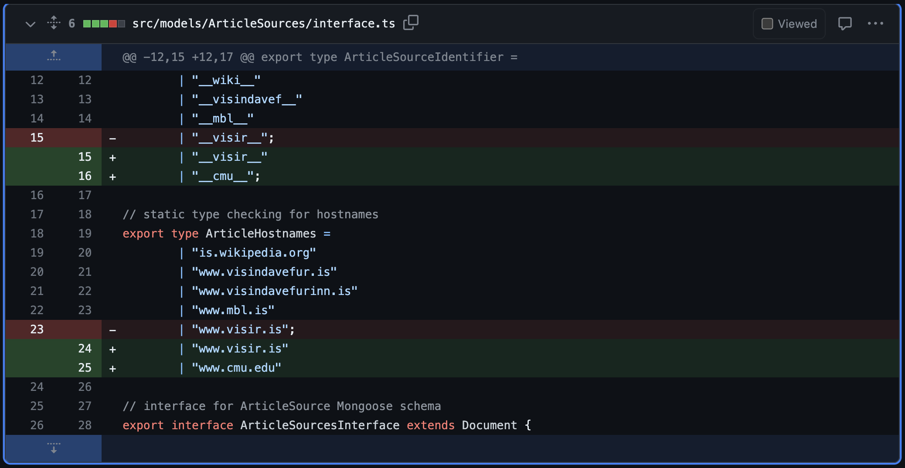
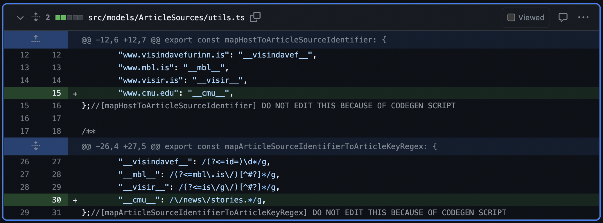
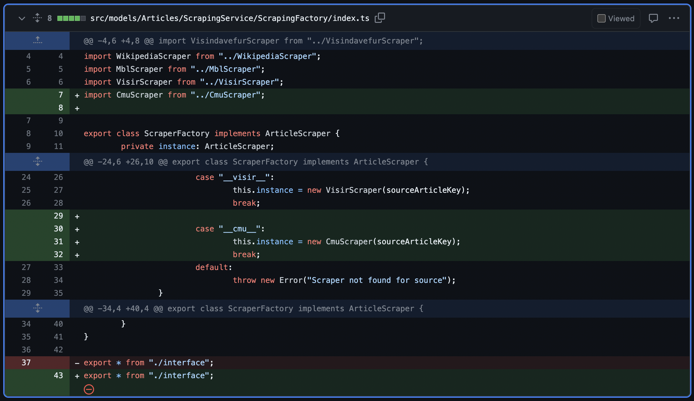

# Adding Sources

When we say sources, we are refering to the answer sources. That is, websites that contain information in which users can search to find answers.
Each source has three components to it. First, it needs a scraper. Second, it needs programmatic definitions. And third, it needs to be recognized by the programmable search engine.

For example, if a user wants to find out the birth day of Mahatma Gandhi on Wikipedia. The Programmable Search Engine will need to be told that [en.wikipedia.org](en.wikipedia.org) is a domain that should be included in search results. Second, the GameQA API will need to have a defined scraper which reads the text contents from a Wikipedia article and outputs a list of paragraphs. Lastly, to tie these two together, it needs to have a few artifacts in code that will tie it all together.

This is likely the most involved section of the API setup, so we have created a pull request that you can find [here](https://github.com/gameqa/api-is/pull/42). We will refer to this pull request to show you how to connect the source. We will start with the programmatic definitions, then we will create a scraper, and lastly we will update the google search engine.

## The source
It will be easier to conceptualize this process by looking at a specific example. Let's say that we want the app to show all news articles from `www.cmu.edu`. Let's look at an example URL from CMU:

`https://www.cmu.edu/news/stories/archives/2023/june/carnegie-mellon-alumna-wins-two-2023-tony-awardsr`

There are two important concepts we need to understand before proceeding. It's the *source identifier* and *key*. The source identifier is something we create. In this example we will say that the identifier `__cmu__` represents the `www.cmu.edu` hostname. So the identifier relates to the domain or the source itself. The key identifies the article. The key in this context might be `/news/stories/archives/2023/june/carnegie-mellon-alumna-wins-two-2023-tony-awardsr`. Note that the key could also be `2023/june/carnegie-mellon-alumna-wins-two-2023-tony-awardsr`. It's a design choice that we can make. The only constraint here is that you should be able to reconstruct the entire URL with just the *source identifier* and the *key*. 

## The code

In the API, navigate to `src/models/ArticleSources/interface.ts`. Decide on a source string that looks like `__this__` and add it to `ArticleSourceIdentifier` like the pull request shows (see below image). Additionally, add the hostname to `ArticleHostnames`.



Next, navigate to `src/models/ArticleSources/utils.ts` and add a mapping from your hostname to identifier in the `mapHostToArticleSourceIdentifier` map. Lastly on this page, create a mapping from your identifier to a regex pattern in `mapArticleSourceIdentifierToArticleKeyRegex`. The regex pattern should match the *key* for each article. See the below screenshot on how we retrieve the key for the CMU articles.



These are all the declerations you need to do prior to creating a scraper.

## The scraper

Now you will need to create a scraper. This is a class with a specific interface that will tell the api how to scrape a website. Imagine that the scraper is given just the *key* for the article. The scraper will need to a) reconstruct the URL and b) use a HTML scraping package to retrieve the article text. Refer the scraper in the pull request (39 lines in `src/models/Articles/ScrapingService/CmuScraper/index.ts`). You will need to create a directory, e.g. `src/models/Articles/ScrapingService/MyNewScraper` and add an `index.ts` file with the scraper code.

First off, reconstruct the URL in the `axios.get` method call.

```ts
public async scrapeArticle(): Promise<ScrapeData> {
    const { data, headers } = await axios.get<string>(
        `https://www.cmu.edu${this.sourceArticleKey}`
    );
    // ...
}
```

Second, write logic using `Cheerio` to scrape the website. There are webtutorials on how to use `Cheerio`. We also recommend using ChatGPT to help with extracting the based on your website. Cheerio works by using `css` selectors.

In our case we extracted the paragraphs and the title like so:

```ts
const $ = cheerio.load(data);
const articleText = $("main p");

this.paragraphs = [];
articleText.each((index, element) => {
    const paragraphText = $(element).text();
    this.paragraphs.push(paragraphText);
});

this.title = $("h1 span").text()

return {
    extract: this.paragraphs[0],
    title: this.title.trim(),
    sourceArticleKey: this.sourceArticleKey,
    paragraphs: this.paragraphs.map((para) => para.trim()),
};
```

We recommend that you use the class definition in the pull request. The interface needs to be the same, however we recommend that you deviate as little as possible from the structure of the function as well. Now head to the `src/models/Articles/ScrapingService/ScrapingFactory/index.ts`. Add your scraper into the switch case by adding the a case with your identifier and under that case add the scraper like so:



Lastly you need to add the identifier to a type union in `src/models/Articles/ScrapingService/ScrapingFactory/interface.ts` as in the pull request.

## Testing

Once you've created your scraper you can add a small file to test that it works. It is easiest to add a file called `src/models/Articles/ScrapingService/ScrapingFactory/testScraper.ts` (see example in pull request) that looks something like this:

```ts
import {ScraperFactory} from "./";

const SCRAPER_IDENTIFIER = "__cmu__";
const SCRAPER_KEY = "/news/stories/archives/2023/june/carnegie-mellon-alumna-wins-two-2023-tony-awardsr";

const scraper = new ScraperFactory(SCRAPER_IDENTIFIER, SCRAPER_KEY);
scraper.scrapeArticle().then(console.log).catch(console.log);
```

You can QA test the scraper by answering the following questions:

* does the new scraper return an object?
* does the object include a key called 'extract' which is a string that is an *extract* from the article?
* does the object contain a key called 'title' which is the title of the article as a string?
* does the object contain a key called 'title' which is the title of the article as a string?
* does the object contain a key called 'sourceArticleKey' which has the same value as the article's key?
* does the object contain a key called 'paragraphs' which is an array of strings, which contain all the paragraphs in the article?

