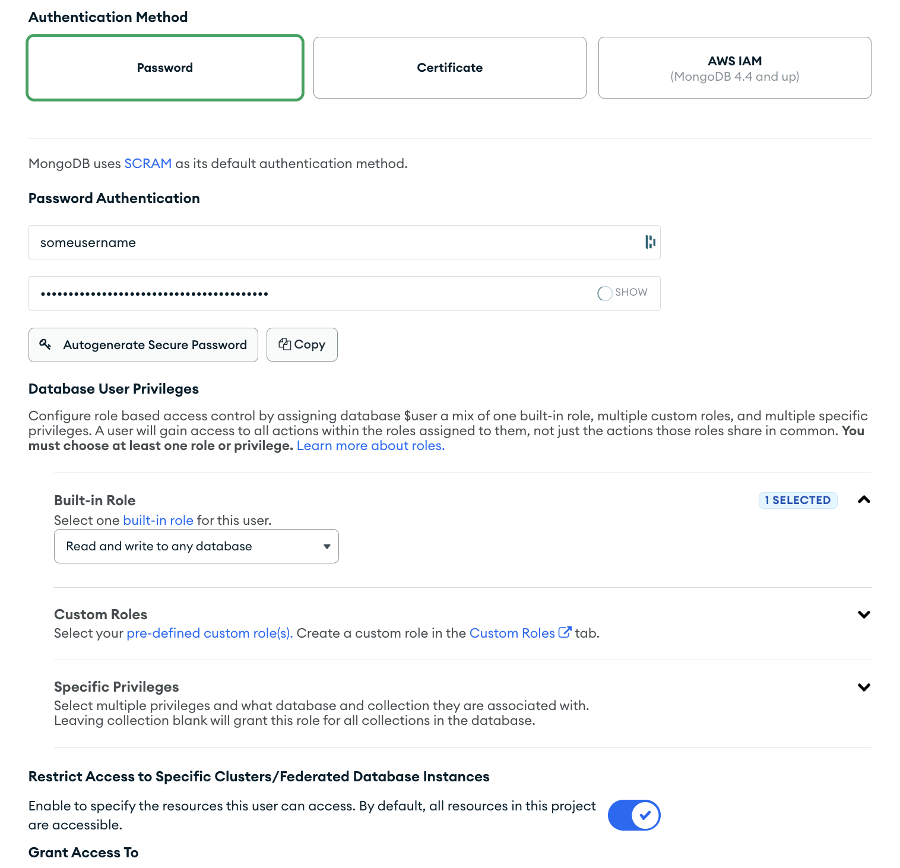
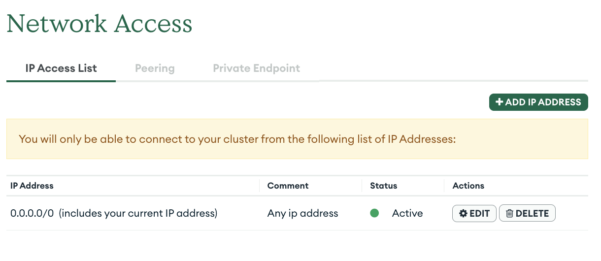
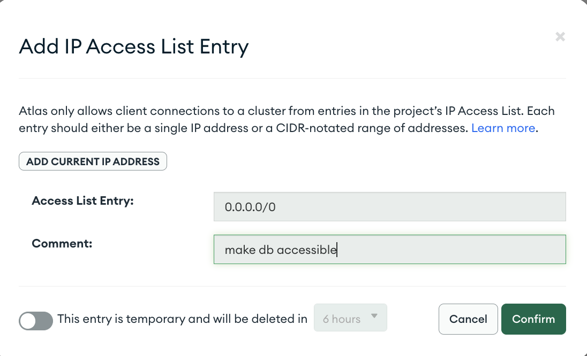
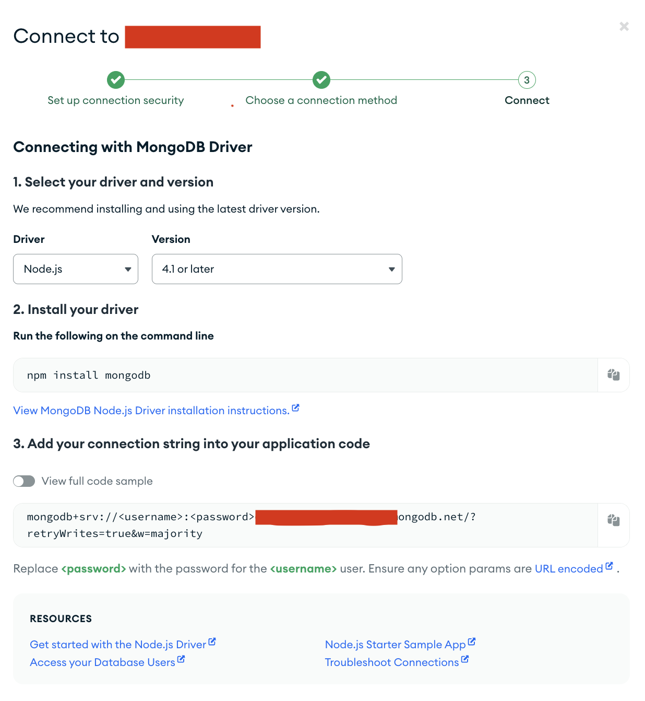

# Creating a Database

In order to run and use the API you will need to connect to a databse instance. This database will store all the data gathered by the users of the app. We use MongoDB in our deployment and recommend the same.


Here, we will walk you through the steps of creating a MongoDB instance and integrating it into the API.

## Sign Up for Atlas

You can start by registering for [MongoDB Atlas](https://www.mongodb.com/cloud/atlas/register). Signing up is completely free and it offers both free and paid database options.

## Creating a Database

After logging into Atlas, the default view you'll see is `Databse Deployments`. You can access this website through the side-bar `Deployments > Database`. On this page there is a "Create" button. Click that button.

There are three options to choose from for your MongoDB setup: serverless, deticated, and shared. For our projects we have selected the shared option. It provides transparent pricing, and an easy way to back-up any data. Lastly, give your DB (cluster) an easy to remember name and press "Create Cluster". 

## Creating a User

In order to be able to connect your database to your localized API, you need to create a username and a password within Atlas. These credentials will be a part of the connection string provided to the API. Under `Security > Database Access`. click the "Add New Database User" button. 

In the form, choose "Password" as the authentication method and choose a username and password. Under the "Database User Privileges" section, select a "Built-in Role" and give the user access to "Read & Write to ay database". Below, you can restrict the access to the cluster (Database) you just created.



## Network Access

Lastly, you will need to specify access lists to tell Atlas which IP addresses your DB should respond to. In this tutorial, we will be using Heroku which does not allocate a static IP address for your server. However, if you are comfortable with deployment and whish to use other services (like AWS, Google Cloud, Azure, etc.) you can configure the back-end to use a static IP.

Since we like keeping things simple and efficient and thus be using Heroku, we will hence need to grant access to all IP addresses. Or that is, all users who have the username and password to authenticate. Navigate to `Security > Network access` in the side navigation. There you'll see a table with entries, one per IP or IP range:



Click "Add IP Address" in the top right corner and whitelist all IPs with the following entry



## Connecting to the API

In order to connect your localized API to the database, open up (or create if it doesn't exist already) an .env file. Add these lines to it

```
# local mongo instance
MONGODB_URI_LOCAL= ...

# production mongo instance
MONGODB_URI= ...
```

Assign both environment (for now) as `mongodb+srv://<username>:<password>@<clustersubdomains>.mongodb.net/?retryWrites=true&w=majority` where the username, password, and clustersubdomains represent the connection information found on atlas. In the `Database Deployment` page you should see a "Connect" button next to each database. Clicking that button will give you a model interface where you will pick "Driver" and then "Node.js". The connection string should be visible in this view. See screen grab for reference. 

