# Google Search Engine
Google Cloud provides a service called [Programmable Search Engine](https://programmablesearchengine.google.com) which provides us with an API access to its search engine.
We levarage this API during the Google Search Stage when we ask users to 
find answers to questions. This is a paid service with a number of free searches every single day. After that, you pay for every 1,000 requests. During the original data collection for GameQA we paid less than $100 for all 23,000 questions and 13,000 answers. 

## Signing up for Google Cloud
If you haven't already, you need to register an account with Google Cloud. If you don't have an account, you're in luck because Google Cloud is giving $300 in free credits for new signups!

## Setting up a billing account
Assuming that you just created an account, you will need to create a billing account. When we retraced the steps of registering with Google Cloud, this was a part of the registration flow.

## Enable the search API
Google Cloud has a lot of great tools and services available through its cloud platform. In order to use some of them, like the custom Google search API, we will need to enable them first. Start by heading to the left side bar to find "Enabled APIs & services" under "APIs & Services". 

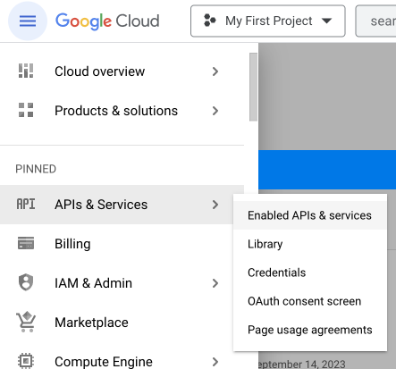

Click the button that says "ENABLE APIS AND SERVICES"

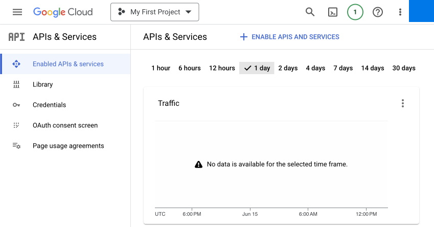

This will bring up a search field where you can type in "Custom Searh API". Open up the search result

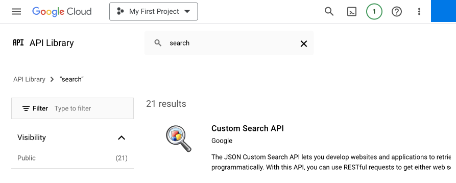

Click "ENABLE".

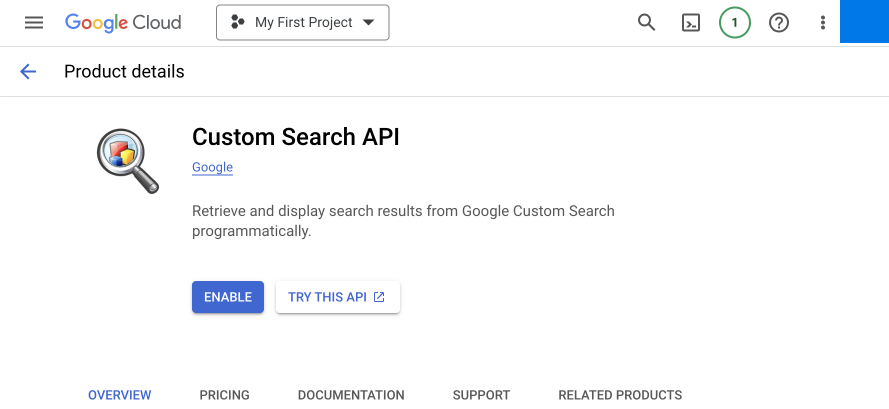

This will show you a form on how which service exactly you want to use and details about your service account. Fill those out like the images below show:

## Creating an API Key

Now that you have enabled the Custum Search API, let's create an API key that will allow you to call the Search API from your server. Navigate to the "Credentials" page by accessing it through the left search bar. 

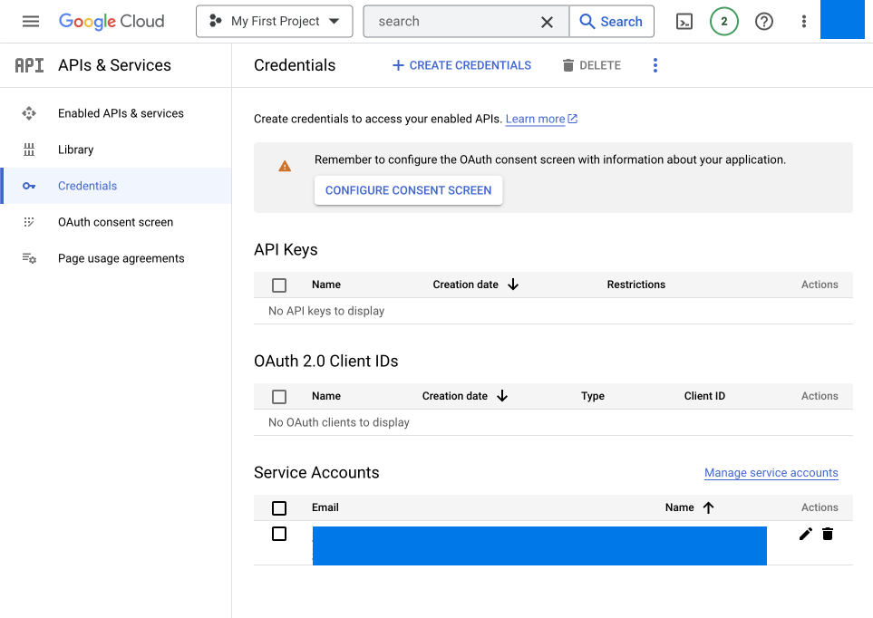

From there, click "CREATE CREDENTIALS" which will show you a drop-down. From this drop-down select "API key". 

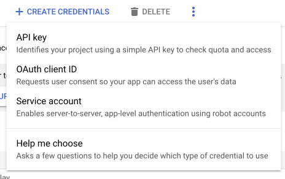

Once you've created the API key, copy it and store it in a safe location.

Before we continue, you should click on the API key you just created on the credentials page. This should bring up a screen where you can restrict the access of this API key to the Custom Search API. This is useful if the key is lost or stolen then it can't be misused for other APIs by a malicious user.

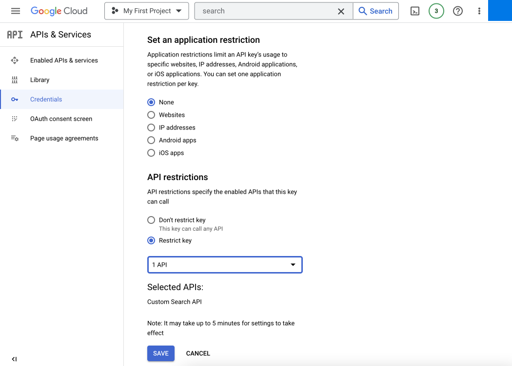

## Creating the search engine

Now that you've enabled the API and created an API key, we are finally ready to create our own programmable search enginew with Google that allows us to leverage Google's proprietary search functionality and extend it by filtering only domains relevant to our use case. Head on to the [Programmable Search Engine Console](https://programmablesearchengine.google.com/) to get started.

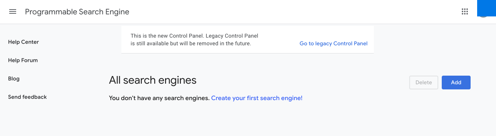

Click "Add" to add your own. You can have multiple search engine with different setups, filters and so on. Fill out the form like this. Start by putting "en.wikipedia.org" as a specific page to query. You can change this later by removing it, adding other pages, and even express patterns to search for. However, for now let us use the english wikipedia as we will use it as a running example later on in the tutorial.

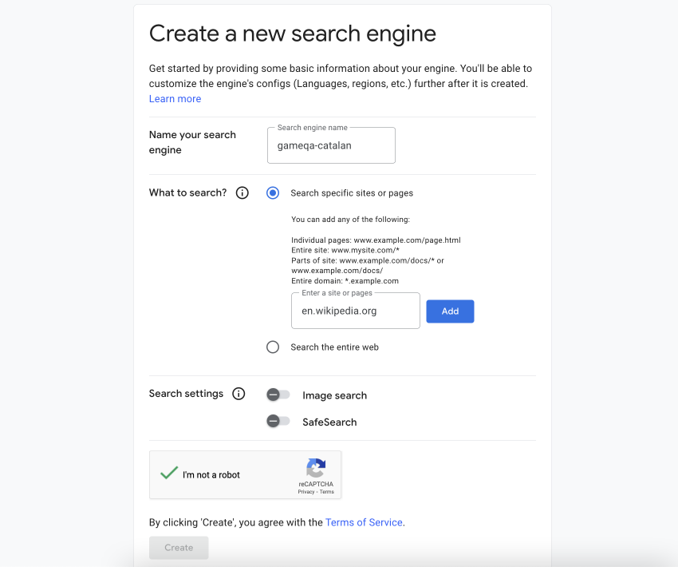

Now, you have succesfully created your own programmable search engine. You will be given a code example of how you can render the search engine in HTML

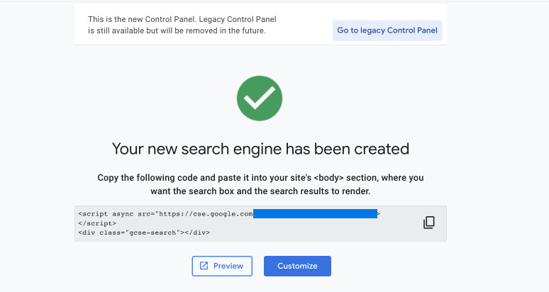

Lastly, click "Customize" in order to open up a view where you can change the settings and setup for the search engine. We will delve into this view later, but for now notice the "Search Engine ID".

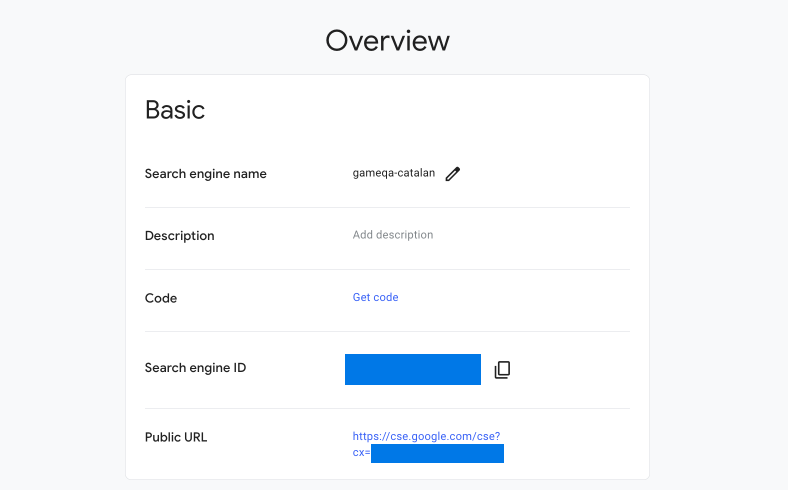

This ID, along with your API Key from above will be the two necessary pieces of information to call the Google Search API in your back-end code. We will revisit this page later once we create new answer sources which will be the baseline for how you add new answer sources to your crowdsourcing efforts.

## Connecting API to Search API

Lastly, in order to connect the API to ...