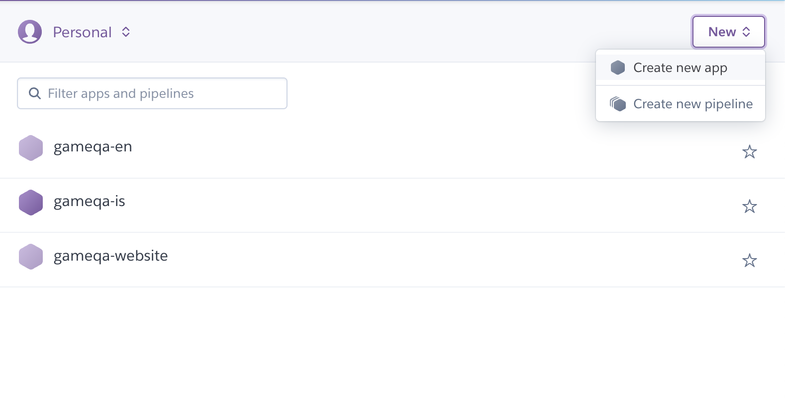

# Heroku Setup

In this tutorial, we will use [Heroku](https://www.heroku.com) to host and deploy the API. Heroku is a bit pricier than many cloud platforms (such as AWS or Azure) but it provides easy hosting and easy pipelines to automatically deploy code from Github, saving you time in the long run. At the time of writing this, the required compute costs $50 per month.

## Creating a project

Once you have created an account with Heroku, you can create "a new app" as shown in the screen grab below. 

Now, give it a descriptive name (such as `gameqa-<your iso language code>`) and press "Create app".

## Connecting to github

The first screen you should see after creating your Heroku project should be something like this:

If you haven't already, create a new git repo for your localized api and push it to Github. We recommend that the repo should be owned by the `GameQA` organization as it might help future researchers build on top of your translations and work.

Now, click Github in the "Deployment Method" section. This will prompt you to connect and authorize Github with Heroku and lastly choose the repo for the API. After you've succesfully connected Github to Heroku the UI will show you the following:

Next, head down on this page and enable Automatic Deploys. If successful you should be prompted with a message telling you that automatic deployments are now enabled.

**Note:** If you need to, in the future, manually deploy or restart the server then there is a "Manual deploy" section on the same page which restarts the server based on the head on your git repos main branch on Github.

## Next Steps

We won't actually try to run the API in the cloud just yet. First we need to setup a few things such as Redis, Sendgrid, and Google's programmable search engine.
