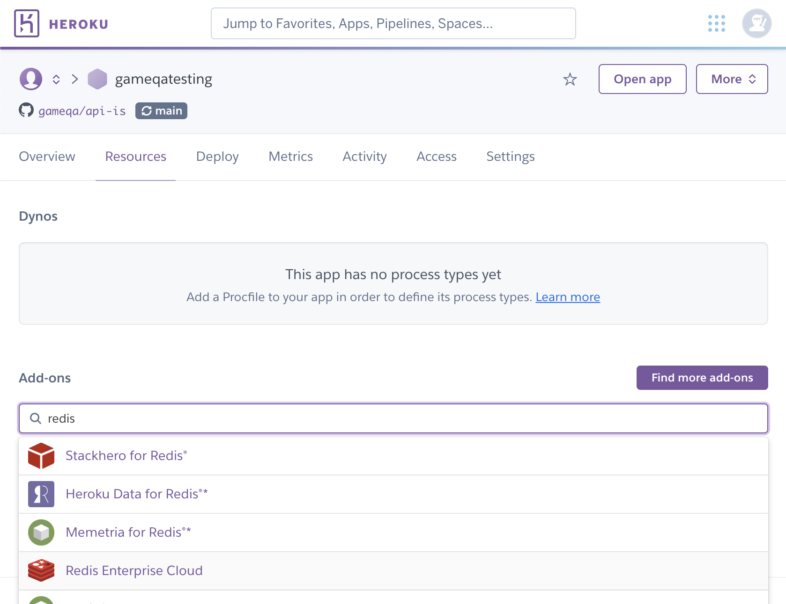
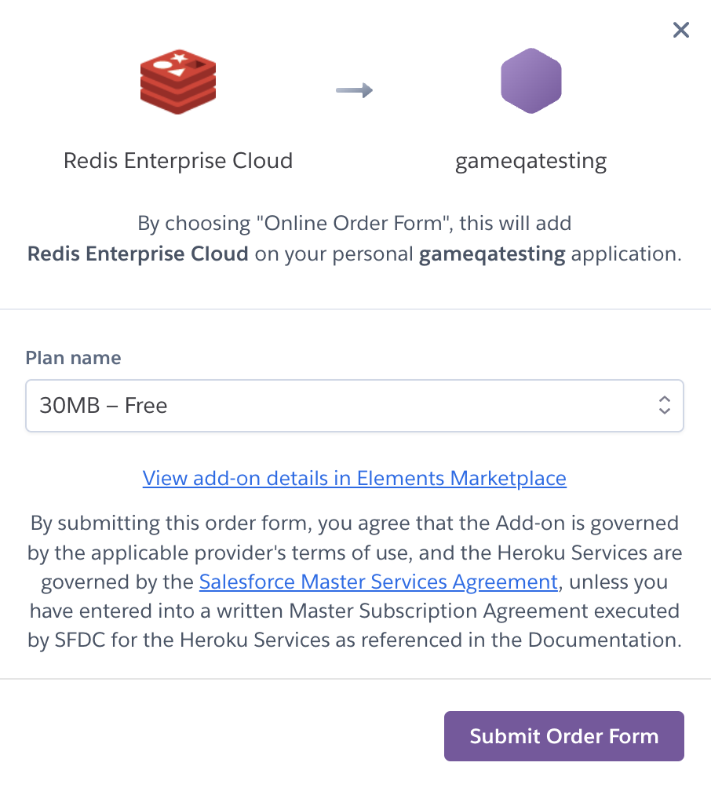
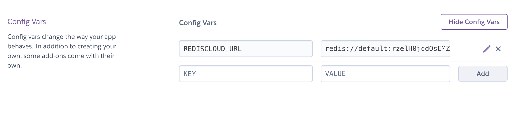
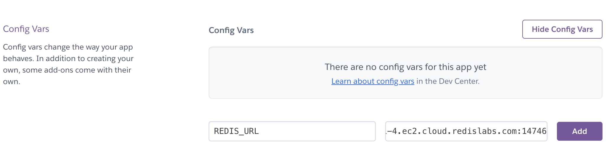

# Installing Redis

Redis is an open source in-memory key-value store which sidesteps the need for slow disk reads. We use Redis to speed up the API and reduce load on the database. In the next few steps, we will install and run docker both locally (on your machine) for any local testing or development you will do.

## Installing Docker
The best way to run Redis locally is to use Docker to do so. If you do not already have Docker installed, here are installation instructions.

* **Mac OS:** [Installation Instructions](https://docs.docker.com/desktop/install/mac-install/)
* **Windows:** [Installation Instructions](https://docs.docker.com/desktop/install/windows-install/)
* **Linux:** [Installation Instructions](https://docs.docker.com/desktop/install/linux-install/)


## Running Redis Daemon
Once you've installed Docker you can use it to run Redis via the commandline. Make sure first, that you have docker running. Run the following shell command

```sh
$ sudo docker run -p 6379:6379 -it redis/redis-stack-server:latest
```

If successful, you will see a list of messages printed out in the console with the last one saying something along the lines of `* Ready to accept connections`. Now we can connect the API to Redis.

## Connectin API to Redis

### Locally

In the .env file you have in the root of the folder add the following information

```
# redis URL
REDIS_URL=redis://127.0.0.1:6379
```

This tells the server to connect to Redis listening on port `6379` on your local machine.


### On Heroku

When you're running the API on Heroku, you will need to have a Redis compute deployed as well. Luckily for us, Heroku has a free tier version of Redis we can use.

First, on your projects dashboard on Heroku, navigate to the Resources tab. There you will see a section called `Add-ons`. In the search bar type "redis" and select "Redis Enterprise Cloud". 



This will open up a modal. Select the default free edition.




Now, head on to the "Settings" tab in your Heroku project. On this page there is a `Config Vars` section. The config variables are inherently the environment variables Heroku shares with your server in production. Click the button to reveal the config variables. You should see a variable added by the Redis add-on.




Notice that the name of the config variable is different to what we used in our local, .env file. To resolve this, copy the URL that was automatically added to your config variables. Create a new config variable called `REDIS_URL` and assign it to the URL you just copied. Once you're done you can remove the automatically generated config variable.


