# Setting up SendGrid

Sendgrid 
is an email service that sends signup and other standardized emails from GameQA. In order to a get a service like Sendgrid
to work there needs to be a certain level of integration and setup. However, we've taken care of most of the integration
so you will only need to add what is absolutely necessary.

Sendgrid is a paid service, however, the volume of emails sent out by the system is so low that it will likely qualify for a free tier throughout the data collection

## Creating an account
Start by creating an account on [Sendgrid](https://app.sendgrid.com).

## Creating Templates
Sendgrid allows you to create what they call "dynamic templates". With these dynamic templates you can send standardized emails to users with dynamic data (such as  verification codes) sent from our API. You will need to create two such templates. One for verification codes on sign-up and one for users when they reset their passwords. The logic to send these emails is already embedded into the API, now we just need to create (or register) templates in your [Sendgrid Portal](https://app.sendgrid.com) that display these codes. 

Start by navigating to the sidebar to find the dynamic email template page. 

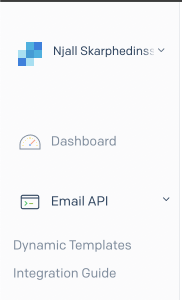

Once you're on the page for dynamic email templates you can click "Create a Dynamic Template" in the top right corner.

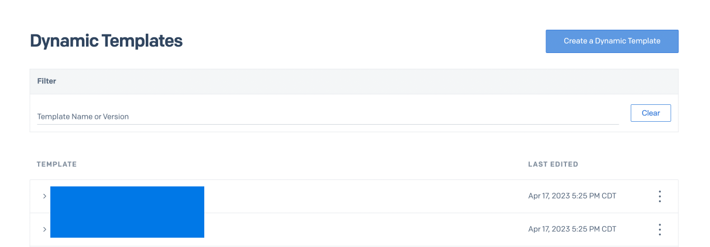

In the creation form, give the template a memorable name that describes the template like so:

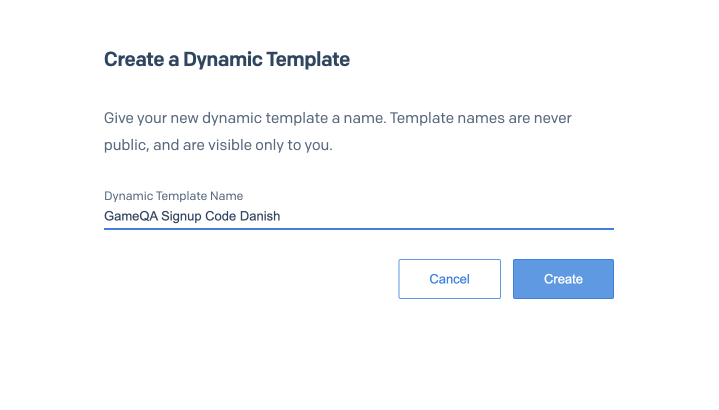

Once you've created the template you'll see that it currently has no versions. Click "Add Version"

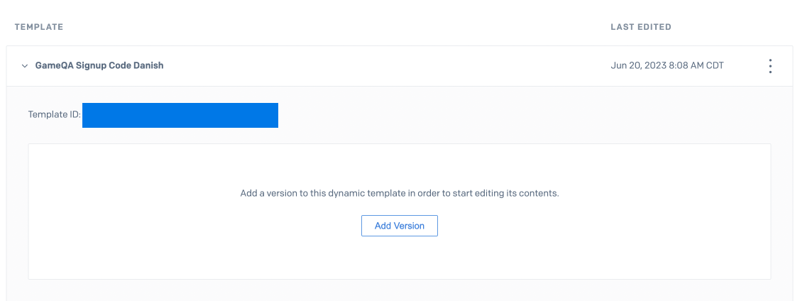

When prompted with the choice, select "Blank Template".

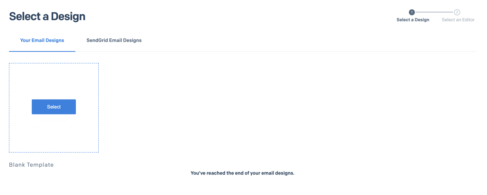

Then proceed to the "Code Editor"

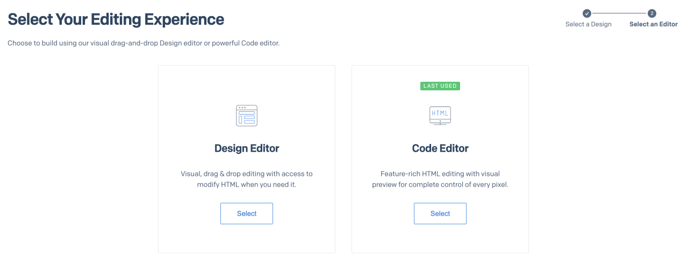

Once you're in the code editor you will see two tabs in the top left corner. One that says "code" and another one that says "test data". The code tab should have some default HTML code. Add the following HTML line into the editor

```html
<p>{{verificationCode}}</p>
```

The result should look something like this:

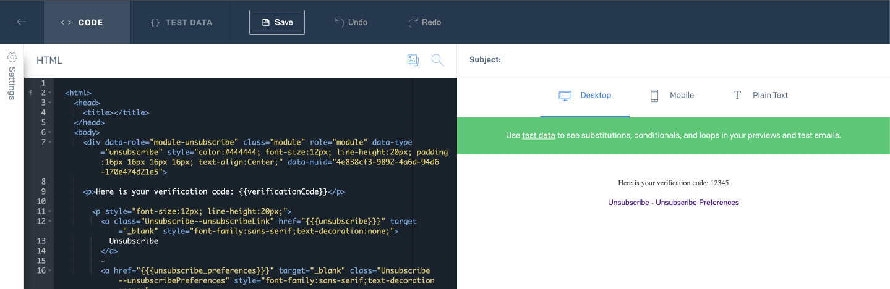

Now, in the "test data" tab add this JSON:

```json
{
    "verificationCode": "123456"
}
```

The outcomee should look something like this.

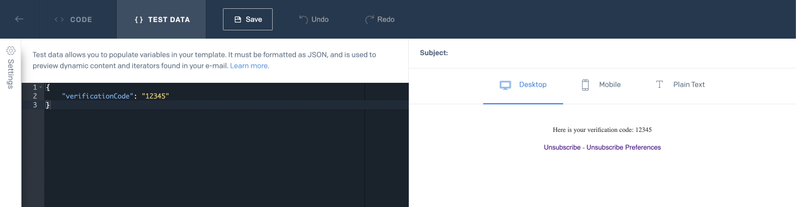

If you can see the HTML preview on the right side update with the number you typed in "test data" then this template is ready

**IMPORTANT:** Hit "Save" to save your progress.

**NOTE:** you can style this with HTML and CSS

Lastly, create another template for resetting your password by following the same steps **except** the string injected into the template is called `resetPasswordCode` instead of `verificationCode`. Make sure to set up the HTML and test data accordingly.

## Sender Authentication

In order to send emails via Sendgrid, you need to have control over a domain. This could either be a domain that you reserve for the data collection OR it could be your institutions (universities) domain. This is essentially the domain any emails will be sent from when using sendgrid.

Start by selecting "Sender Authentication" from the left-side navigation bar.

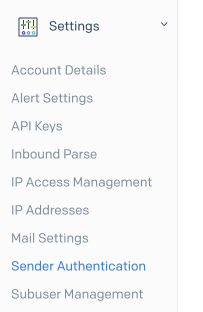

Once you're there press "Activate your domain". You will see a series to step which are quite easy to follow. The only requirement here is that you have access to the DNS records for your domain or can send instructions to a systems administrator to do this for you.

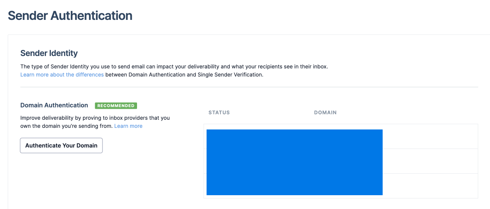

Next, choose your DNS provider.

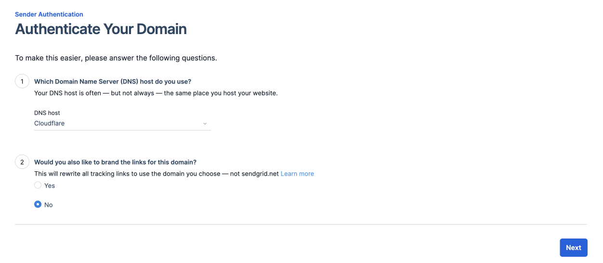

Fill out the name of your domain like so:

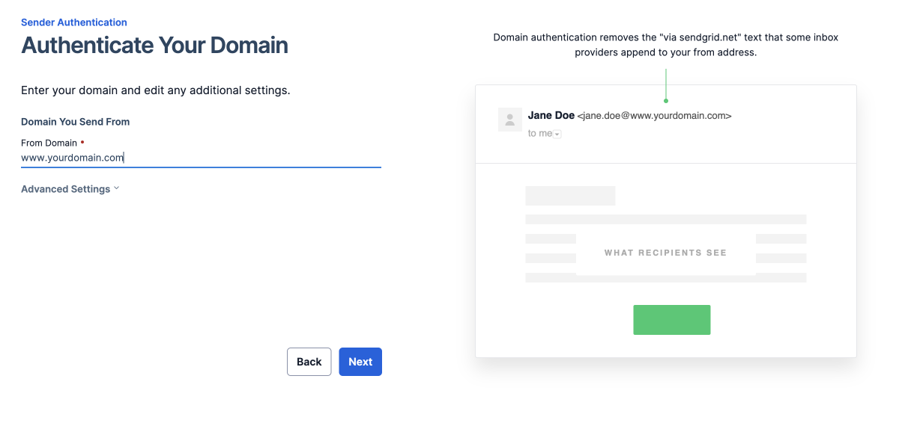

Lastly, you will see a list of DNS records which you will need to add to your domain. Sendgrid offers you to do this automatically, manually, or forward this to a coworker (your domain administrator)
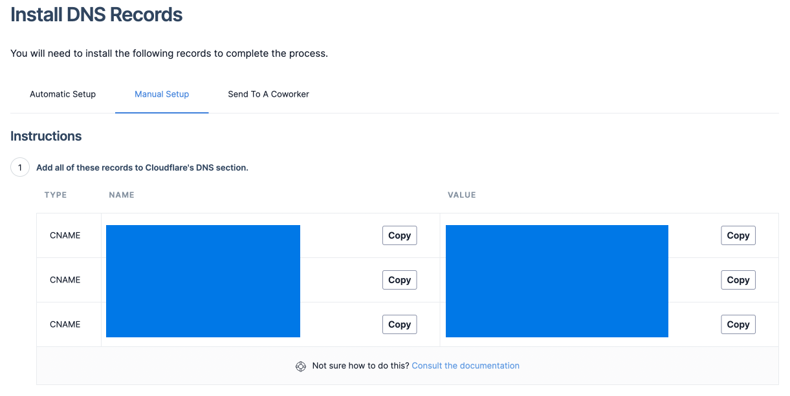

Once everything is set up you can click this button to verify that the setup is correct. Once it passes all the tests you will be ready to start sending emails with this domain.

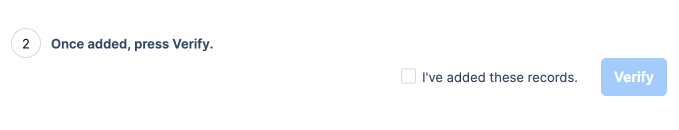

## Api Keys

## Updating Environment Variables

## Updating API Codebase

## Testing Sendgrid Integration
